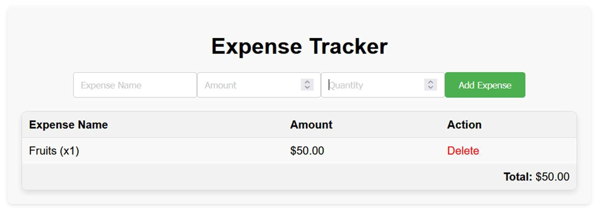

# Expense Tracker Web App

A lightweight, client‑side application for recording daily expenses, built with **HTML**, **CSS**, and **JavaScript**.  
The app stores data in **localStorage**, so your expense history persists between sessions without any backend.

## Features

- **Add expenses** with name, amount, and quantity.
- **View** a running list of expenses and the **total cost** in real time.
- **Delete** individual entries.
- Responsive, mobile‑friendly layout.

## Technologies Used

| Technology | Purpose |
|------------|---------|
| HTML5      | Markup structure |
| CSS3       | Styling and responsive design |
| JavaScript | Application logic and DOM manipulation |
| localStorage | Client‑side persistence |

## Getting Started

Clone the repository and open `index.html` in any modern browser:

```bash
git clone https://github.com/<your-username>/expense-tracker.git
cd expense-tracker
```

Then simply open `index.html`:

```bash
# macOS
open index.html

# Windows
start index.html
```

## How It Works

1. **Form Submission** – Users enter the expense details; JavaScript validates input and updates the list.
2. **State Management** – Expenses are stored in an array mirrored to `localStorage`.
3. **Dynamic Rendering** – Each change re‑renders the table and recalculates totals.

## Folder Structure

```
expense-tracker/
├── index.html
├── style.css
└── script.js
```

## Contributing

Pull requests are welcome! For major changes, please open an issue first to discuss what you would like to change.

## License

This project is open‑sourced under the MIT License.

## 📸 Screenshots

### 🖥️ Main Dashboard


### ➕ Add Expense 
 (screenshots/sc3.png)

### 🧾 Expense Table with Total


